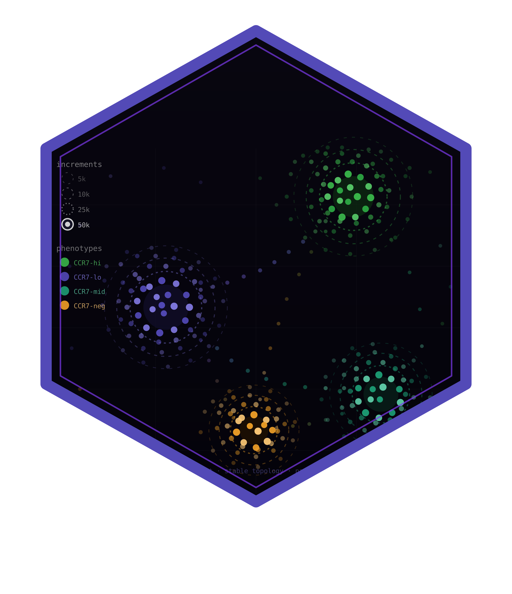

# songR 

<!-- badges: start -->
[](https://github.com/cttir/songR/actions/workflows/R-CMD-check.yaml)
[](https://cttir.github.io/songR/)
[](https://CRAN.R-project.org/package=songR)
[](https://codecov.io/gh/cttir/songR)
[](https://opensource.org/licenses/MIT)
<!-- badges: end -->

## Overview

**songR** is a SONG-inspired dimensionality-reduction tool for R. It
implements the
[Self-Organizing Nebulous Growths (SONG)](https://doi.org/10.1109/TNNLS.2020.3023941)
algorithm of Senanayake et al. (2021) natively in R and C++ (no Python or
`reticulate`), staying as close to the reference implementation as is feasible.

SONG's key advantages over t-SNE and UMAP:

| Feature | SONG | t-SNE | UMAP |
|---------|------|-------|------|
| **Incremental updates** | Yes | No | No |
| **Parametric model** | Yes (codebook) | No | Optional |
| **Noise robustness** | High | Low | Medium |
| **Global structure** | Good | Poor | Good |

New data can be added to an existing embedding without reinitializing or
retraining the model, making SONG ideal for streaming data, growing
datasets, and experiments where data arrives in batches.

## Fidelity to the reference implementation

songR is validated against the original Python SONG with a tiered set of
golden-fixture parity tests. The honest, layer-by-layer picture:

- **Deterministic components** (distances, nearest-coding-vector assignment,
  the rational-quadratic kernel `(a, b)`, growth thresholds) reproduce the
  reference to **≤ 1e-5** (the float32-vs-double floor).
- **Clustering quality (AMI)** is **statistically identical** to the reference
  — e.g. 0.949 = 0.949 on the raw embedding, and 0.560/0.551 and 0.618/0.596
  on the UMAP-dispersed Fashion-MNIST and MNIST runs.
- **The default UMAP-dispersed visualization** is **close in global structure**
  (Procrustes R² ≈ 0.79–0.85) but **not identical in absolute layout**, because
  of (1) the different stochastic optimizers in `uwot` vs. `umap-learn` and
  (2) a small set of documented, AMI-neutral algorithmic divergences.

Bit-identical embeddings are neither targeted nor achievable (the reference is
`float32` + numba `fastmath` + two PRNG streams). See the
[reference-parity summary](tests/testthat/fixtures/reference/PARITY.md) and the
side-by-side [reproduction report](tests/reproduction-report/) for the full
evidence.

## Installation

```r
# Install from CRAN (when available)
install.packages("songR")

# Or install the development version from GitHub
# install.packages("devtools")
devtools::install_github("cttir/songR")
```

## Quick Start

```r
library(songR)

# Fit a SONG model
model <- song(as.matrix(iris[, 1:4]), seed = 42)
plot(model, color_by = iris$Species)

# Incremental update with new data
model <- update(model, new_data_matrix)

# Project new points into existing embedding
new_coords <- predict(model, newdata = held_out_matrix)
```

## Key Features

### Incremental Visualization

Train on an initial batch, then add more data without recomputing from
scratch. Existing point positions are preserved:

```r
# Train on first batch
model <- song(batch1, epochs = 20L, seed = 42)

# Add second batch -- existing embedding is preserved
model <- update(model, batch2, epochs = 20L)

# Get embedding for ALL points
emb <- predict(model, newdata = rbind(batch1, batch2))
```

### Parametric Projection

Once trained, a SONG model can project unseen data without retraining:

```r
new_coords <- predict(model, newdata = held_out_data)
```

### Bundled Dataset

songR ships with `songR_blobs`, a synthetic 8-cluster dataset in 20
dimensions for quick benchmarking:

```r
data(songR_blobs)
model <- song(songR_blobs$data, epochs = 15L, seed = 42)
plot(model, color_by = songR_blobs$labels)
```

### Interactive Comparison App

Launch a Shiny app comparing SONG, t-SNE, and UMAP side-by-side with
dark mode support:

```r
run_songR_app()
```

The app supports uploading custom data, tuning all SONG hyperparameters,
running incremental updates, and exporting embeddings and plots.

## When to Use SONG

- **Incremental/streaming data**: Data arrives in batches and you need a
  stable, growing visualization.
- **Heterogeneous increments**: New data may contain classes or structures
  not present in the original data.
- **Noisy or mixed clusters**: SONG is more tolerant to noise and cluster
  overlap than t-SNE.
- **Parametric mapping**: SONG retains a codebook model that can project
  new points without retraining.
- **Large-scale cytometry/single-cell**: SONG handles 1M+ cells
  incrementally with stable embeddings (see tutorials).

## Vignettes and Tutorials

### CRAN Vignettes

- **Introduction to songR** -- Full overview of the API with iris and
  songR_blobs examples
- **Getting Started with songR** -- Quick-start guide covering fitting,
  updating, predicting, and tuning

### pkgdown Articles

- **[Reproducing Paper Figures](vignettes/articles/reproducing_paper_figures.Rmd)** --
  Reproduces key experiments from Senanayake et al. (2021) using songR
  (heterogeneous/homogeneous increments, CDY stability, noise tolerance,
  topology preservation, AMI scores)
- **[Interactive Shiny App](vignettes/articles/songR_shiny_app.Rmd)** --
  Guide to the built-in comparison app with dark mode

### Full-Scale Tutorial Scripts

The `tutorials/` directory contains scripts for full-scale reproduction
of all paper figures and tables on real datasets (MNIST, Fashion-MNIST,
Wong CyTOF 1.27M cells, COIL-20, Samusik):

| Script | Paper Figure | Dataset |
|--------|-------------|---------|
| `02_fig3_fashion_mnist_heterogeneous.R` | Fig. 3 | Fashion-MNIST (70k) |
| `03_fig4_mnist_heterogeneous.R` | Fig. 4 | MNIST (70k) |
| `04_fig5_wong_homogeneous.R` | Fig. 5 | Wong CyTOF (1.27M) |
| `05_fig6_cdy_lines.R` | Fig. 6 | Multiple |
| `06_fig7_table_IV_noise_tolerance.R` | Fig. 7 / Table IV | Gaussian blobs |
| `07_fig8_coil20_topology.R` | Fig. 8 | COIL-20 (1440) |
| `08_table_II_heterogeneous_ami.R` | Table II | Multiple |
| `09_table_III_homogeneous_ami.R` | Table III | Multiple |
| `11_extra_static_benchmark.R` | -- | All datasets |
| `12_extra_hyperparam_sensitivity.R` | -- | songR_blobs |
| `13_extra_runtime_benchmark.R` | -- | Scaling test |

Run all tutorials:
```r
source("tutorials/00_install_dependencies.R")
source("tutorials/01_prepare_data.R")
# Then source any tutorial script
```

## Key Parameters

| Parameter | Default | Effect |
|-----------|---------|--------|
| `epochs` | 50 | More = better convergence, slower |
| `epsilon` | 0.9 | Edge decay rate (0--1); lower = sparser graph |
| `spread_factor` | 0.5 | Growth threshold; higher = more coding vectors |
| `k` | 3 | Neighborhood size for graph construction |
| `dispersion` | TRUE | UMAP refinement step for visual quality |
| `alpha` | 1.0 | Initial learning rate |

## Citation

If you use `songR` in published research, please cite both this
R package and the underlying SONG algorithm:

**R package:**

> Heller, R. (2026). songR: Self-Organizing Nebulous
> Growths for Dimensionality Reduction. R package version 0.1.0.
> https://github.com/cttir/songR

**Underlying algorithm:**

> Senanayake, D. A., Wang, W., Naik, S. H., & Halgamuge, S. (2021).
> Self-Organizing Nebulous Growths for Robust and Incremental Data
> Visualization. *IEEE Transactions on Neural Networks and Learning
> Systems*, 32(10), 4588-4602.
> [doi:10.1109/TNNLS.2020.3023941](https://doi.org/10.1109/TNNLS.2020.3023941)

```r
citation("songR")
```

## Acknowledgments

This package is an independent R/C++ re-implementation of the SONG
algorithm using [RcppArmadillo](https://cran.r-project.org/package=RcppArmadillo).
The original algorithm was developed by Damith Senanayake, Wei Wang,
Shalin Naik, and Saman Halgamuge at the University of Melbourne.
The original Python implementation is available at
[github.com/damithsenanayake/SONG](https://github.com/damithsenanayake/SONG).

## Use of LLM tools

Portions of this package were prepared with assistance from large language model tooling for
narrowly defined, non-authorial tasks: copyediting, prose smoothing, Markdown/LaTeX formatting,
scaffolding of boilerplate files (CI configs, build scripts), code refactoring. The tools used were [Chat AI](https://kisski.gwdg.de/leistungen/2-02-llm-service/),
the LLM service of KISSKI (GWDG), and a self-hosted **Mistral Small (24B, Apache-2.0)** run locally via
[Ollama](https://ollama.com/) and the `ollamar` R package — local inference only, with no data sent to
third parties for the self-hosted model.

All scientific claims, methodological choices, analyses, interpretations, and conclusions are the
author's own. No LLM-generated text was incorporated without review and revision, and every reference
was verified against its DOI, arXiv ID, or ISBN.

## License

MIT (c) Raban Heller

The SONG algorithm implemented here is derived from the reference
implementation of Senanayake et al., which is licensed under the
BSD 3-Clause License (© 2020 Damith A. Senanayake). The upstream copyright
notice and license are reproduced verbatim in
[`inst/COPYRIGHTS`](inst/COPYRIGHTS).
