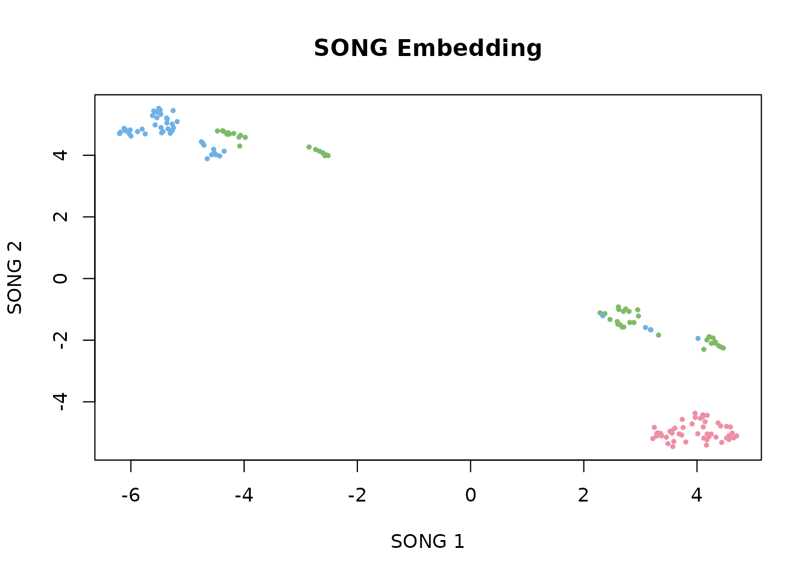
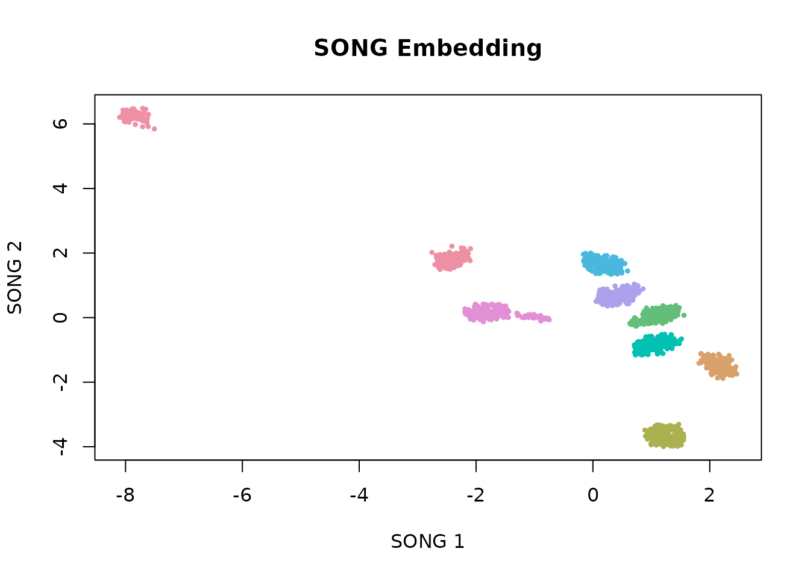
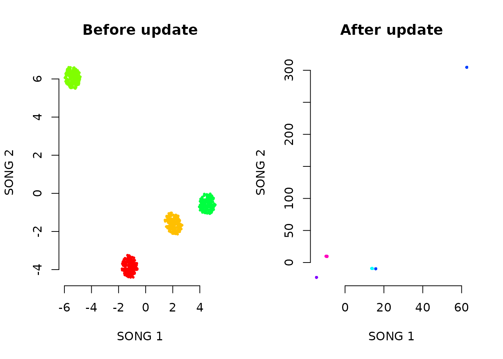
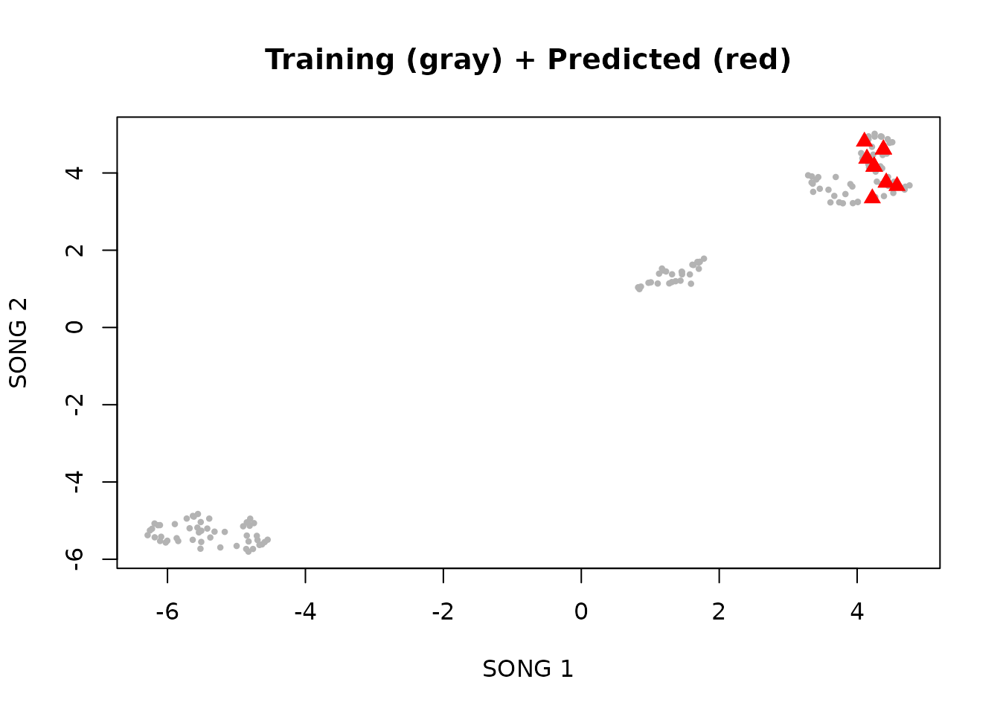
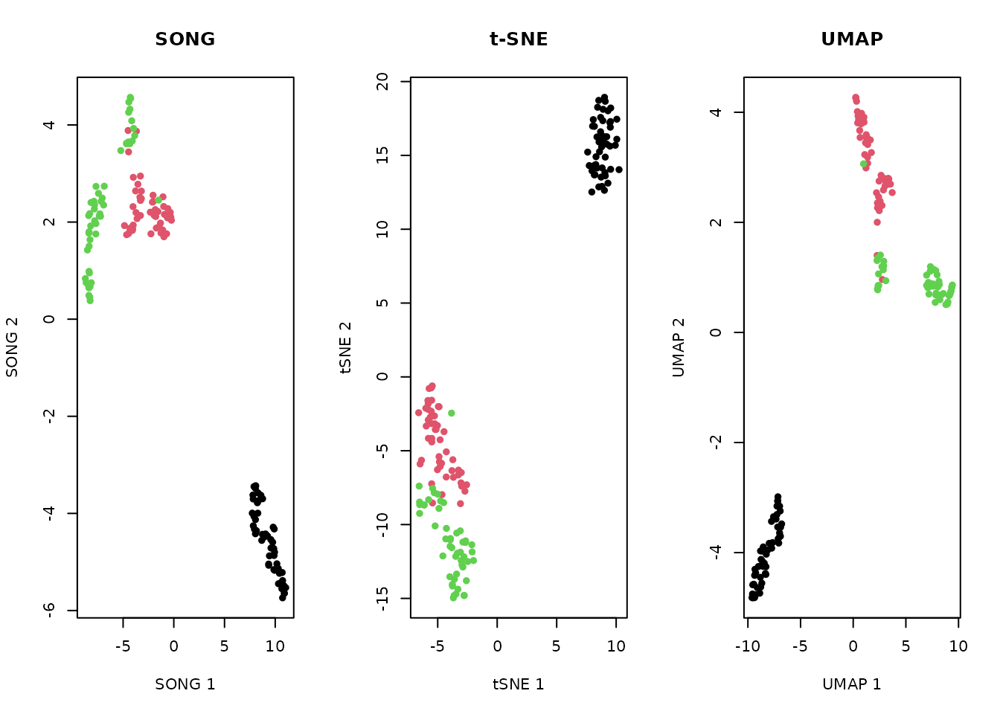
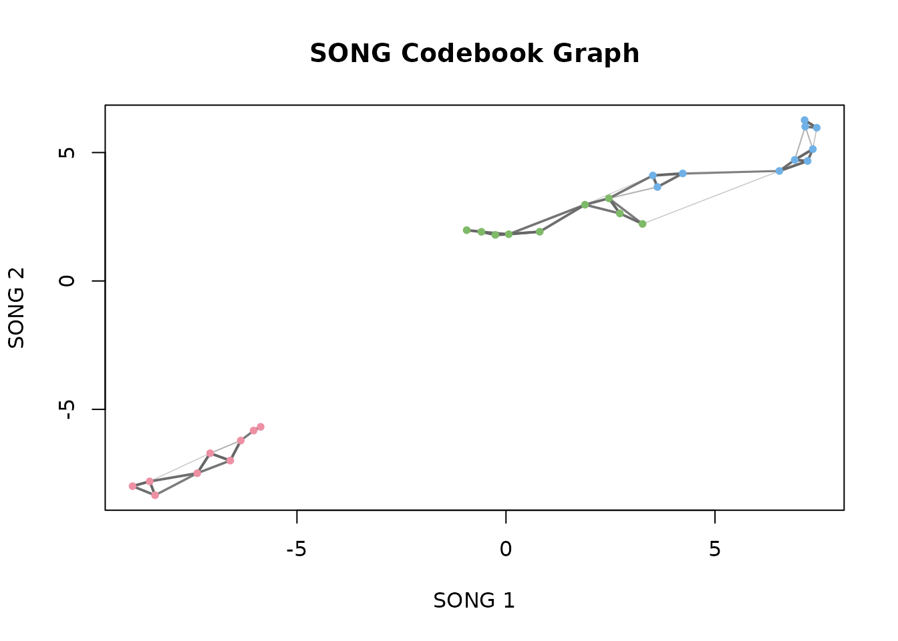

# Introduction to songR

[](https://github.com/r-heller/songR/actions/workflows/R-CMD-check.yaml)
[](https://r-heller.github.io/songR/)
[](https://CRAN.R-project.org/package=songR)
[](https://app.codecov.io/gh/r-heller/songR?branch=main)
[](https://cran.r-project.org/package=songR)
[](https://cran.r-project.org/package=songR)
[](https://opensource.org/licenses/MIT)
[](https://lifecycle.r-lib.org/articles/stages.html#experimental)

### What is SONG?

The Self-Organizing Nebulous Growths (SONG) algorithm is a parametric
method for nonlinear dimensionality reduction. Unlike t-SNE and UMAP,
SONG supports **incremental visualization**: new data can be added to an
existing embedding without reinitializing or retraining the model. SONG
is also robust to noise and highly mixed clusters.

| Property            | SONG           | t-SNE     | UMAP      |
|---------------------|----------------|-----------|-----------|
| Incremental updates | Yes            | No        | Limited   |
| Parametric model    | Yes (codebook) | No        | Optional  |
| Noise robustness    | High           | Low       | Medium    |
| Speed               | Moderate       | Slow      | Fast      |
| Deterministic       | With seed      | With seed | With seed |

The algorithm is described in:

> Senanayake, D. A., Wang, W., Naik, S. H., & Halgamuge, S. (2021).
> Self-Organizing Nebulous Growths for Robust and Incremental Data
> Visualization. *IEEE TNNLS*, 32(10), 4588–4602.

### Installation

``` r

# Install from GitHub
devtools::install_github("cttir/songR")
```

### Quick Start with Iris

``` r

library(songR)

model <- song(as.matrix(iris[, 1:4]), seed = 42, epochs = 20L)
#> Epoch 1/20 | CVs: 3 | QE: 1.5296 | so_lr: 1.0000 | lr: 1.0000
#> Epoch 2/20 | CVs: 5 | QE: 0.8782 | so_lr: 0.9876 | lr: 0.9500
#> Epoch 3/20 | CVs: 9 | QE: 0.5992 | so_lr: 0.9512 | lr: 0.9000
#> Epoch 4/20 | CVs: 16 | QE: 0.4691 | so_lr: 0.8936 | lr: 0.8500
#> Epoch 5/20 | CVs: 28 | QE: 0.3987 | so_lr: 0.8187 | lr: 0.8000
#> Epoch 6/20 | CVs: 28 | QE: 0.3752 | so_lr: 0.7316 | lr: 0.7500
#> Epoch 7/20 | CVs: 28 | QE: 0.3812 | so_lr: 0.6376 | lr: 0.7000
#> Epoch 8/20 | CVs: 28 | QE: 0.3555 | so_lr: 0.5420 | lr: 0.6500
#> Epoch 9/20 | CVs: 28 | QE: 0.3573 | so_lr: 0.4493 | lr: 0.6000
#> Epoch 10/20 | CVs: 28 | QE: 0.3492 | so_lr: 0.3633 | lr: 0.5500
#> Epoch 11/20 | CVs: 28 | QE: 0.3412 | so_lr: 0.2865 | lr: 0.5000
#> Epoch 12/20 | CVs: 28 | QE: 0.3356 | so_lr: 0.2204 | lr: 0.4500
#> Epoch 13/20 | CVs: 28 | QE: 0.3251 | so_lr: 0.1653 | lr: 0.4000
#> Epoch 14/20 | CVs: 28 | QE: 0.3210 | so_lr: 0.1209 | lr: 0.3500
#> Epoch 15/20 | CVs: 28 | QE: 0.3148 | so_lr: 0.0863 | lr: 0.3000
#> Epoch 16/20 | CVs: 28 | QE: 0.3114 | so_lr: 0.0601 | lr: 0.2500
#> Epoch 17/20 | CVs: 28 | QE: 0.3087 | so_lr: 0.0408 | lr: 0.2000
#> Epoch 18/20 | CVs: 28 | QE: 0.3076 | so_lr: 0.0270 | lr: 0.1500
#> Epoch 19/20 | CVs: 28 | QE: 0.3063 | so_lr: 0.0174 | lr: 0.1000
#> Epoch 20/20 | CVs: 28 | QE: 0.3048 | so_lr: 0.0110 | lr: 0.0500
#> Running UMAP dispersion step...
plot(model, color_by = iris$Species)
```



### Working with the Bundled Dataset

``` r

data(songR_blobs)
model_blobs <- song(songR_blobs$data, seed = 42, epochs = 15L, verbose = FALSE)
plot(model_blobs, color_by = songR_blobs$labels)
```



### Incremental Visualization

This is SONG’s key feature. We train on the first half of the data, then
incrementally add the second half.

``` r

# Split data
data(songR_blobs)
n <- nrow(songR_blobs$data)
idx1 <- 1:(n / 2)
idx2 <- (n / 2 + 1):n

# Train on first half
model_v1 <- song(songR_blobs$data[idx1, ], seed = 42, epochs = 15L, verbose = FALSE)

# Update with second half
model_v2 <- update(model_v1, songR_blobs$data[idx2, ], epochs = 10L, verbose = FALSE)

par(mfrow = c(1, 2))
plot(model_v1$embedding, pch = 16, cex = 0.5,
     col = rainbow(8)[as.integer(songR_blobs$labels[idx1])],
     main = "Before update", xlab = "SONG 1", ylab = "SONG 2", bty = "n")
plot(model_v2$embedding, pch = 16, cex = 0.5,
     col = rainbow(8)[as.integer(songR_blobs$labels[idx2])],
     main = "After update", xlab = "SONG 1", ylab = "SONG 2", bty = "n")
```



The codebook grows to accommodate new data while preserving the existing
embedding structure.

### Predicting New Points

``` r

# Train on 90%, predict on 10%
train_idx <- 1:135
test_idx <- 136:150

model <- song(as.matrix(iris[train_idx, 1:4]), epochs = 15L, seed = 42,
              verbose = FALSE)
new_coords <- predict(model, newdata = as.matrix(iris[test_idx, 1:4]))

# Plot training and test points together
plot(model$embedding[, 1], model$embedding[, 2],
     col = "gray70", pch = 16, cex = 0.6,
     xlab = "SONG 1", ylab = "SONG 2", main = "Training (gray) + Predicted (red)")
points(new_coords[, 1], new_coords[, 2], col = "red", pch = 17, cex = 1.2)
```



### Comparison: SONG vs t-SNE vs UMAP

``` r

mat <- as.matrix(iris[, 1:4])

# SONG
song_model <- song(mat, seed = 42, epochs = 20L, verbose = FALSE)

# t-SNE
tsne_result <- Rtsne::Rtsne(mat, dims = 2, perplexity = 30,
                              verbose = FALSE, check_duplicates = FALSE)

# UMAP
umap_result <- uwot::umap(mat, n_neighbors = 15, verbose = FALSE)

par(mfrow = c(1, 3))
col <- as.integer(iris$Species)
plot(song_model$embedding, col = col, pch = 16, main = "SONG",
     xlab = "SONG 1", ylab = "SONG 2")
plot(tsne_result$Y, col = col, pch = 16, main = "t-SNE",
     xlab = "tSNE 1", ylab = "tSNE 2")
plot(umap_result, col = col, pch = 16, main = "UMAP",
     xlab = "UMAP 1", ylab = "UMAP 2")
```



All three methods separate the Iris species, but only SONG supports
incremental updates and retains a parametric codebook model.

### Tuning Guide

| Parameter | Default | Description |
|----|----|----|
| `spread_factor` | 0.5 | Growth threshold; higher = more coding vectors. Range: (0, 1). |
| `k` | 3 | Neighborhood size. Must be \>= `d + 1`. Lower = finer topology. |
| `epsilon` | 0.9 | Edge decay rate (0–1). Lower = sparser, faster-pruning graph. |
| `epochs` | 50 | Number of self-organisation iterations. More = better convergence. |
| `alpha` | 1.0 | Initial learning rate. |
| `a`, `b` | 1.577, 0.895 | Kernel shape parameters from the UMAP literature. |
| `dispersion` | TRUE | UMAP refinement step for visual cluster separation. |

### The Codebook Model

SONG retains a codebook of coding vectors connected by a
topology-preserving graph. This is what enables incremental updates and
fast projection.

``` r

model <- song(as.matrix(iris[, 1:4]), seed = 42, epochs = 15L, verbose = FALSE)
summary(model)
#> SONG model summary
#> ==================
#>   Input: 150 points in 4 dimensions
#>   Coding vectors: 28 
#>   Compression ratio: 5.4:1 
#>   Edges: 48 
#>   Mean edge strength: 0.8365 
#>   Output dimensionality: 2 
#>   Epochs: 15 (max epochs) 
#> 
#> Parameters:
#>   k = 3 | epsilon = 0.9 | spread_factor = 0.5 
#>   a = 1.577 | b = 0.895 | alpha = 1
plot(model, type = "graph", color_by = iris$Species)
```



### Interactive Comparison App

For interactive exploration, launch the Shiny comparison app:

``` r

run_songR_app()
```

This opens a browser-based interface to compare SONG, t-SNE, and UMAP
side-by-side on your own data.

### Citation

``` r

citation("songR")
#> To cite the songR R package, use:
#> 
#>   Heller, R. (2026). songR: Self-Organizing Nebulous Growths for
#>   Dimensionality Reduction. R package version 0.1.0.
#>   https://github.com/cttir/songR
#> 
#> To cite the underlying SONG algorithm, use:
#> 
#>   Senanayake, D. A., Wang, W., Naik, S. H., & Halgamuge, S. (2021).
#>   Self-Organizing Nebulous Growths for Robust and Incremental Data
#>   Visualization. IEEE Transactions on Neural Networks and Learning
#>   Systems, 32(10), 4588-4602. doi:10.1109/TNNLS.2020.3023941
#> 
#> To see these entries in BibTeX format, use 'print(<citation>,
#> bibtex=TRUE)', 'toBibtex(.)', or set
#> 'options(citation.bibtex.max=999)'.
```

## Use of LLM tools

Portions of this package were prepared with assistance from large
language model tooling for narrowly defined, non-authorial tasks:
copyediting, prose smoothing, Markdown/LaTeX formatting, scaffolding of
boilerplate files (CI configs, build scripts), code refactoring. The
tools used were [Chat
AI](https://kisski.gwdg.de/leistungen/2-02-llm-service/), the LLM
service of KISSKI (GWDG), and a self-hosted **Mistral Small (24B,
Apache-2.0)** run locally via [Ollama](https://ollama.com/) and the
`ollamar` R package — local inference only, with no data sent to third
parties for the self-hosted model.

All scientific claims, methodological choices, analyses,
interpretations, and conclusions are the author’s own. No LLM-generated
text was incorporated without review and revision, and every reference
was verified against its DOI, arXiv ID, or ISBN.

### Session Info

``` r

sessionInfo()
#> R version 4.6.0 (2026-04-24)
#> Platform: x86_64-pc-linux-gnu
#> Running under: Ubuntu 24.04.4 LTS
#> 
#> Matrix products: default
#> BLAS:   /usr/lib/x86_64-linux-gnu/openblas-pthread/libblas.so.3 
#> LAPACK: /usr/lib/x86_64-linux-gnu/openblas-pthread/libopenblasp-r0.3.26.so;  LAPACK version 3.12.0
#> 
#> locale:
#>  [1] LC_CTYPE=C.UTF-8       LC_NUMERIC=C           LC_TIME=C.UTF-8       
#>  [4] LC_COLLATE=C.UTF-8     LC_MONETARY=C.UTF-8    LC_MESSAGES=C.UTF-8   
#>  [7] LC_PAPER=C.UTF-8       LC_NAME=C              LC_ADDRESS=C          
#> [10] LC_TELEPHONE=C         LC_MEASUREMENT=C.UTF-8 LC_IDENTIFICATION=C   
#> 
#> time zone: UTC
#> tzcode source: system (glibc)
#> 
#> attached base packages:
#> [1] stats     graphics  grDevices utils     datasets  methods   base     
#> 
#> other attached packages:
#> [1] songR_0.1.0
#> 
#> loaded via a namespace (and not attached):
#>  [1] vctrs_0.7.3        cli_3.6.6          knitr_1.51         rlang_1.2.0       
#>  [5] xfun_0.59          otel_0.2.0         S7_0.2.2           textshaping_1.0.5 
#>  [9] jsonlite_2.0.0     glue_1.8.1         Rtsne_0.17         htmltools_0.5.9   
#> [13] ragg_1.5.2         sass_0.4.10        uwot_0.2.4         scales_1.4.0      
#> [17] rmarkdown_2.31     grid_4.6.0         evaluate_1.0.5     jquerylib_0.1.4   
#> [21] fastmap_1.2.0      yaml_2.3.12        lifecycle_1.0.5    FNN_1.1.4.1       
#> [25] compiler_4.6.0     RColorBrewer_1.1-3 fs_2.1.0           Rcpp_1.1.1-1.1    
#> [29] farver_2.1.2       systemfonts_1.3.2  lattice_0.22-9     digest_0.6.39     
#> [33] R6_2.6.1           bslib_0.11.0       Matrix_1.7-5       gtable_0.3.6      
#> [37] tools_4.6.0        ggplot2_4.0.3      pkgdown_2.2.0      cachem_1.1.0      
#> [41] desc_1.4.3
```
