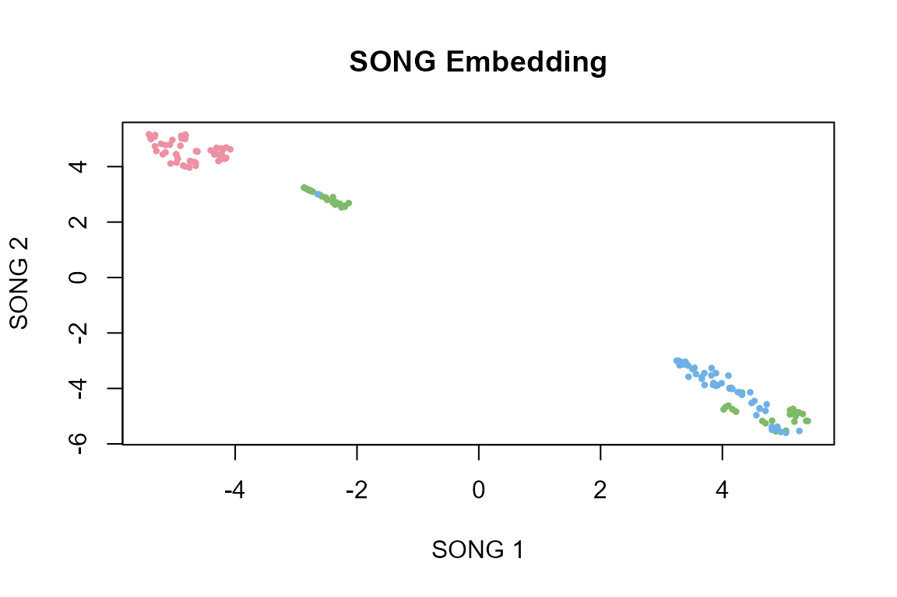
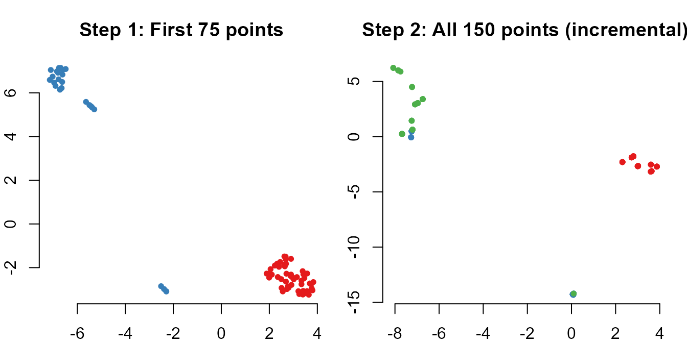

# Getting Started with songR

## What is SONG?

**SONG** (Self-Organizing Nebulous Growths) is a parametric,
incremental, noise-tolerant dimensionality reduction technique for data
visualization. Unlike t-SNE and UMAP, SONG retains a parametric model
that can be updated with new data without reinitializing the entire
embedding. This makes SONG ideal for streaming data, incremental
analysis, and noisy datasets.

The algorithm was developed by [Senanayake et
al. (2021)](https://doi.org/10.1109/TNNLS.2020.3023941) and published in
IEEE Transactions on Neural Networks and Learning Systems. The `songR`
package provides a native R/C++ implementation using RcppArmadillo.

## Installation

``` r
# From CRAN (when available):
install.packages("songR")

# Development version from GitHub:
devtools::install_github("r-heller/songR")
```

## Quick Start on Iris

The simplest way to use songR is the
[`song()`](https://r-heller.github.io/songR/reference/song.md) function,
which fits a SONG model and returns an embedding:

``` r
library(songR)

model <- song(as.matrix(iris[, 1:4]),
              epochs = 10L,
              seed = 42,
              verbose = FALSE)

print(model)
#> SONG model
#>   Input: 150 points in 4 dimensions
#>   Coding vectors: 28 
#>   Edges: 49 
#>   Output dimensionality: 2 
#>   Epochs: 10 (max epochs)
```

The model contains the 2D embedding for all input points. Let’s
visualize it:

``` r
plot(model, color_by = iris$Species)
```



Each color represents a different iris species. SONG discovers the
natural cluster structure in the 4-dimensional data and maps it to 2D.

## Bundled Dataset

songR ships with `songR_blobs`, a synthetic 8-cluster dataset in 20
dimensions designed for quick testing:

``` r
data(songR_blobs)
cat("Data:", nrow(songR_blobs$data), "x", ncol(songR_blobs$data), "\n")
#> Data: 1600 x 20
cat("Clusters:", length(unique(songR_blobs$labels)), "\n")
#> Clusters: 8

model_blobs <- song(songR_blobs$data,
                    epochs = 15L,
                    seed = 42,
                    verbose = FALSE)

plot(model_blobs, color_by = songR_blobs$labels)
```


## Incremental Visualization

The key advantage of SONG is incremental updating. You can train on an
initial batch of data and then add more data later without recomputing
from scratch. The existing embedding is preserved.

``` r
# Split iris into two halves
X1 <- as.matrix(iris[1:75, 1:4])
X2 <- as.matrix(iris[76:150, 1:4])
labels1 <- iris$Species[1:75]
labels2 <- iris$Species[76:150]

# Fit on first half
model_v1 <- song(X1, epochs = 10L, seed = 42, verbose = FALSE)
emb_v1 <- model_v1$embedding
cat("After batch 1:", nrow(model_v1$C), "coding vectors\n")
#> After batch 1: 17 coding vectors

# Update with second half (NO reinit!)
model_v2 <- update(model_v1, X2, epochs = 10L, verbose = FALSE)
cat("After batch 2:", nrow(model_v2$C), "coding vectors\n")
#> After batch 2: 26 coding vectors

# Get embeddings for ALL points after update
emb_v2_all <- predict(model_v2, newdata = rbind(X1, X2))
```

Let’s see the before/after:

``` r
par(mfrow = c(1, 2), mar = c(2, 2, 3, 1))

# Before: only first 75 points
cols1 <- c(setosa = "#E41A1C", versicolor = "#377EB8",
           virginica = "#4DAF4A")[as.character(labels1)]
plot(emb_v1, pch = 16, col = cols1, cex = 0.8,
     main = "Step 1: First 75 points",
     xlab = "", ylab = "", bty = "n")

# After: all 150 points
cols_all <- c(setosa = "#E41A1C", versicolor = "#377EB8",
              virginica = "#4DAF4A")[as.character(iris$Species)]
plot(emb_v2_all, pch = 16, col = cols_all, cex = 0.8,
     main = "Step 2: All 150 points (incremental)",
     xlab = "", ylab = "", bty = "n")
```



The first 75 points retain their approximate positions while the new
data is smoothly integrated. This stability is measured by the **CDY**
(Consecutive Displacement of Y) metric.

## Projecting New Points

Once trained, a SONG model can project unseen data into the embedding
space without retraining:

``` r
# Train on 80% of iris
train_idx <- sample(150, 120)
test_idx <- setdiff(1:150, train_idx)

model_train <- song(as.matrix(iris[train_idx, 1:4]),
                    epochs = 10L, seed = 42, verbose = FALSE)

# Project the held-out 20%
new_coords <- predict(model_train, newdata = as.matrix(iris[test_idx, 1:4]))

cat("Projected", nrow(new_coords), "new points into",
    ncol(new_coords), "dimensions\n")
#> Projected 30 new points into 2 dimensions
```

``` r
# Plot training points (circles) and projected points (triangles)
emb_train <- model_train$embedding

cols_train <- c(setosa = "#E41A1C", versicolor = "#377EB8",
                virginica = "#4DAF4A")[as.character(iris$Species[train_idx])]
cols_test <- c(setosa = "#E41A1C", versicolor = "#377EB8",
               virginica = "#4DAF4A")[as.character(iris$Species[test_idx])]

plot(rbind(emb_train, new_coords),
     pch = c(rep(16, nrow(emb_train)), rep(17, nrow(new_coords))),
     col = c(cols_train, cols_test),
     cex = c(rep(0.7, nrow(emb_train)), rep(1.2, nrow(new_coords))),
     main = "Training (circles) + Projected (triangles)",
     xlab = "SONG 1", ylab = "SONG 2", bty = "n")
legend("topright",
       legend = c("Training", "Projected"),
       pch = c(16, 17), bty = "n")
```


## Model Inspection

``` r
summary(model_blobs)
#> SONG model summary
#> ==================
#>   Input: 1600 points in 20 dimensions
#>   Coding vectors: 136 
#>   Compression ratio: 11.8:1 
#>   Edges: 527 
#>   Mean edge strength: 0.6810 
#>   Output dimensionality: 2 
#>   Epochs: 15 (max epochs) 
#> 
#> Parameters:
#>   k = 3 | epsilon = 0.9 | spread_factor = 0.5 
#>   a = 1.577 | b = 0.895 | alpha = 1
```

## Key Parameters

| Parameter       | Default | Effect                                         |
|-----------------|---------|------------------------------------------------|
| `epochs`        | 50      | More epochs = better convergence, slower       |
| `epsilon`       | 0.9     | Edge decay: lower = sparser graph              |
| `spread_factor` | 0.5     | Growth threshold: higher = more coding vectors |
| `k`             | 3       | Neighborhood size for graph construction       |
| `dispersion`    | TRUE    | UMAP refinement step for visual quality        |
| `alpha`         | 1.0     | Initial learning rate                          |

## When to Use SONG vs t-SNE vs UMAP

| Feature | SONG | t-SNE | UMAP |
|----|----|----|----|
| Incremental updates | Yes | No | No |
| Parametric model | Yes | No | No |
| Noise tolerance | High | Low | Medium |
| Global structure | Good | Poor | Good |
| Speed (large data) | Medium | Slow | Fast |
| Best for | Streaming, incremental | Static, local detail | Static, fast overview |

## Citation

If you use songR in your research, please cite:

``` r
citation("songR")
```

> Senanayake, D. A., Wang, W., Naik, S. H., & Halgamuge, S. (2021).
> Self-Organizing Nebulous Growths for Robust and Incremental Data
> Visualization. *IEEE Transactions on Neural Networks and Learning
> Systems*, 32(10), 4588-4602.
> [doi:10.1109/TNNLS.2020.3023941](https://doi.org/10.1109/TNNLS.2020.3023941)

## Session Info

``` r
sessionInfo()
#> R version 4.5.2 (2025-10-31 ucrt)
#> Platform: x86_64-w64-mingw32/x64
#> Running under: Windows 11 x64 (build 26200)
#> 
#> Matrix products: default
#>   LAPACK version 3.12.1
#> 
#> locale:
#> [1] LC_COLLATE=English_Germany.utf8  LC_CTYPE=English_Germany.utf8   
#> [3] LC_MONETARY=English_Germany.utf8 LC_NUMERIC=C                    
#> [5] LC_TIME=English_Germany.utf8    
#> 
#> time zone: Europe/Berlin
#> tzcode source: internal
#> 
#> attached base packages:
#> [1] stats     graphics  grDevices utils     datasets  methods   base     
#> 
#> other attached packages:
#> [1] songR_0.1.0
#> 
#> loaded via a namespace (and not attached):
#>  [1] Matrix_1.7-4       gtable_0.3.6       jsonlite_2.0.0     dplyr_1.2.0       
#>  [5] compiler_4.5.2     tidyselect_1.2.1   Rcpp_1.1.1         FNN_1.1.4.1       
#>  [9] jquerylib_0.1.4    systemfonts_1.3.2  scales_1.4.0       textshaping_1.0.5 
#> [13] uwot_0.2.4         yaml_2.3.12        fastmap_1.2.0      lattice_0.22-7    
#> [17] ggplot2_4.0.2      R6_2.6.1           generics_0.1.4     knitr_1.51        
#> [21] htmlwidgets_1.6.4  tibble_3.3.1       desc_1.4.3         bslib_0.10.0      
#> [25] pillar_1.11.1      RColorBrewer_1.1-3 rlang_1.1.7        cachem_1.1.0      
#> [29] xfun_0.57          fs_2.0.1           sass_0.4.10        S7_0.2.1          
#> [33] otel_0.2.0         cli_3.6.5          pkgdown_2.2.0      magrittr_2.0.4    
#> [37] digest_0.6.39      grid_4.5.2         lifecycle_1.0.5    vctrs_0.7.1       
#> [41] evaluate_1.0.5     glue_1.8.0         farver_2.1.2       ragg_1.5.2        
#> [45] rmarkdown_2.31     tools_4.5.2        pkgconfig_2.0.3    htmltools_0.5.9
```
