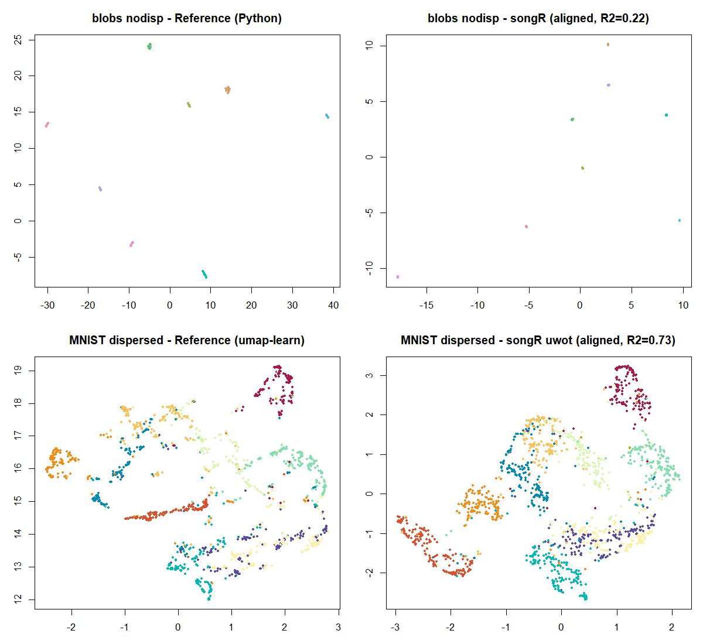

<!-- badges: start -->
[](https://github.com/CTTIR/songR/actions/workflows/R-CMD-check.yaml)
[](https://cttir.github.io/songR/)
[](https://CRAN.R-project.org/package=songR)
[](https://app.codecov.io/gh/CTTIR/songR?branch=main)
[](https://cran.r-project.org/package=songR)
[](https://cran.r-project.org/package=songR)
[](https://opensource.org/licenses/MIT)
[](https://lifecycle.r-lib.org/articles/stages.html#experimental)
<!-- badges: end -->

```{r setup, include = FALSE}
knitr::opts_chunk$set(
  collapse = TRUE,
  comment = "#>",
  fig.width = 7,
  fig.height = 5,
  fig.align = "center",
  out.width = "95%",
  dpi = 150
)
library(songR)
library(viridis)
SEED <- 42L
```

## Overview

This article reproduces key experiments from the SONG paper using the
`songR` package:

> Senanayake, D. A., Wang, W., Naik, S. H., & Halgamuge, S. (2021).
> Self-Organizing Nebulous Growths for Robust and Incremental Data
> Visualization. *IEEE TNNLS*, 32(10), 4588-4602.

All figures use the **viridis plasma** color scale. For full-scale
reproductions with large datasets, see the `tutorials/` folder in the
repository.

## Plasma Color Helpers

```{r helpers}
# Standard scatter using plasma palette
plot_plasma <- function(emb, labels, title = "", pch = 16, cex = 0.5) {
  if (is.factor(labels) || is.character(labels)) {
    labels <- as.factor(labels)
    cols <- viridis::plasma(nlevels(labels), end = 0.92)[as.integer(labels)]
  } else {
    cols <- viridis::plasma(256)[cut(labels, 256, labels = FALSE)]
  }
  plot(emb[, 1], emb[, 2], col = cols, pch = pch, cex = cex,
       xlab = "Dim 1", ylab = "Dim 2", main = title, bty = "n")
}
```

## Figure 3/4: Heterogeneous Increments (Fashion-MNIST / MNIST)

The paper adds 2 new classes per step and tracks how each method handles
the growing embedding. SONG updates incrementally; t-SNE and UMAP refit
from scratch.

Here we demonstrate the principle on the bundled `songR_blobs` dataset
(8 clusters, 20D), adding 2 clusters per step:

```{r fig34-hetero, fig.width = 10, fig.height = 8}
data(songR_blobs)
X <- songR_blobs$data
labs <- as.integer(songR_blobs$labels)

# Define 4 incremental steps: 2 clusters each
set.seed(SEED)
cluster_order <- sample(8)
steps <- list(cluster_order[1:2], cluster_order[3:4],
              cluster_order[5:6], cluster_order[7:8])
step_names <- c("2 clusters", "4 clusters", "6 clusters", "8 clusters")

# Build data for each step
X_list <- lapply(steps, function(cls) X[labs %in% cls, , drop = FALSE])
lab_list <- lapply(steps, function(cls) labs[labs %in% cls])

# SONG incremental
song_embs <- list()
model <- NULL; X_seen <- NULL
for (s in seq_along(X_list)) {
  X_seen <- rbind(X_seen, X_list[[s]])
  if (is.null(model)) {
    model <- song(X_seen, epochs = 15L, seed = SEED, verbose = FALSE)
  } else {
    model <- update(model, X_list[[s]], epochs = 15L, verbose = FALSE)
  }
  song_embs[[s]] <- predict(model, newdata = X_seen)
}

# SONG + Reinit (refit from scratch each step)
reinit_embs <- list()
X_seen <- NULL
for (s in seq_along(X_list)) {
  X_seen <- rbind(X_seen, X_list[[s]])
  m <- song(X_seen, epochs = 15L, seed = SEED, verbose = FALSE)
  reinit_embs[[s]] <- m$embedding
}

# Cumulative labels for coloring
cum_labs <- list()
for (s in seq_along(steps)) cum_labs[[s]] <- unlist(lab_list[1:s])

par(mfrow = c(2, 4), mar = c(2, 2, 2.5, 1))
for (s in 1:4) {
  plot_plasma(song_embs[[s]], factor(cum_labs[[s]]),
              title = if (s == 1) paste0("SONG\n", step_names[s])
                      else step_names[s])
}
for (s in 1:4) {
  plot_plasma(reinit_embs[[s]], factor(cum_labs[[s]]),
              title = if (s == 1) paste0("SONG+Reinit\n", step_names[s])
                      else step_names[s])
}
```

**Key observation**: SONG preserves existing cluster positions as new
clusters are added, while SONG+Reinit recomputes the entire layout.

## Figure 5: Homogeneous Increments (Wong CyTOF)

Homogeneous increments add more data of the same distribution. The paper
uses Wong CyTOF data colored by CCR7 expression. Here we demonstrate
with blobs, adding random subsamples:

```{r fig5-homogeneous, fig.width = 10, fig.height = 5}
data(songR_blobs)
set.seed(SEED)
idx <- sample(nrow(songR_blobs$data))
sizes <- c(400, 800, 1200, 1600)

par(mfrow = c(2, 4), mar = c(2, 2, 2.5, 1))

# SONG incremental
model <- NULL; prev_n <- 0
for (s in seq_along(sizes)) {
  n_s <- sizes[s]
  if (prev_n == 0) {
    X_chunk <- songR_blobs$data[idx[1:n_s], ]
    model <- song(X_chunk, epochs = 15L, seed = SEED, verbose = FALSE)
  } else {
    X_chunk <- songR_blobs$data[idx[(prev_n + 1):n_s], ]
    model <- update(model, X_chunk, epochs = 15L, verbose = FALSE)
  }
  emb <- predict(model, newdata = songR_blobs$data[idx[1:n_s], ])
  cur_labs <- songR_blobs$labels[idx[1:n_s]]
  plot_plasma(emb, cur_labs,
              title = if (s == 1) paste0("SONG\nn=", n_s) else paste0("n=", n_s))
  prev_n <- n_s
}

# SONG+Reinit
for (s in seq_along(sizes)) {
  n_s <- sizes[s]
  m <- song(songR_blobs$data[idx[1:n_s], ], epochs = 15L, seed = SEED, verbose = FALSE)
  cur_labs <- songR_blobs$labels[idx[1:n_s]]
  plot_plasma(m$embedding, cur_labs,
              title = if (s == 1) paste0("SONG+Reinit\nn=", n_s) else paste0("n=", n_s))
}
```

## Figure 6: CDY (Consecutive Displacement of Y)

CDY measures how much existing points move when new data is added.
Lower CDY = more stable embedding.

```{r fig6-cdy, fig.width = 8, fig.height = 4}
data(songR_blobs)
set.seed(SEED)
idx <- sample(nrow(songR_blobs$data))
X <- songR_blobs$data[idx, ]
labs <- songR_blobs$labels[idx]

init_n <- 400
step_n <- 300
n_steps <- 4

# SONG incremental CDY
model <- song(X[1:init_n, ], epochs = 15L, seed = SEED, verbose = FALSE)
prev_emb <- predict(model, newdata = X[1:init_n, ])
song_cdy <- numeric(n_steps)
bound <- init_n

for (i in seq_len(n_steps)) {
  new_bound <- bound + step_n
  model <- update(model, X[(bound + 1):new_bound, ], epochs = 15L, verbose = FALSE)
  curr_emb <- predict(model, newdata = X[1:bound, ])
  song_cdy[i] <- mean(sqrt(rowSums((prev_emb - curr_emb)^2)))
  prev_emb <- predict(model, newdata = X[1:new_bound, ])
  bound <- new_bound
}

# SONG+Reinit CDY
model0 <- song(X[1:init_n, ], epochs = 15L, seed = SEED, verbose = FALSE)
prev_emb <- model0$embedding
reinit_cdy <- numeric(n_steps)
bound <- init_n

for (i in seq_len(n_steps)) {
  new_bound <- bound + step_n
  m <- song(X[1:new_bound, ], epochs = 15L, seed = SEED, verbose = FALSE)
  reinit_cdy[i] <- mean(sqrt(rowSums(
    (prev_emb - m$embedding[1:nrow(prev_emb), ])^2)))
  prev_emb <- m$embedding
  bound <- new_bound
}

# Plot
method_cols <- viridis::plasma(4, end = 0.92)
plot(1:n_steps, song_cdy, type = "b", pch = 16, col = method_cols[1],
     ylim = c(0, max(c(song_cdy, reinit_cdy)) * 1.1),
     xlab = "Increment", ylab = "Mean CDY",
     main = "CDY: Embedding Stability", bty = "n", lwd = 2)
lines(1:n_steps, reinit_cdy, type = "b", pch = 17, col = method_cols[3], lwd = 2)
legend("topright", c("SONG (incremental)", "SONG+Reinit"),
       col = method_cols[c(1, 3)], pch = c(16, 17), lwd = 2, bty = "n")
```

**Key result**: SONG (incremental) displaces existing points far less
than reinitialized methods. In the paper, t-SNE shows CDY 10-50x higher
than SONG.

## Figure 7 / Table IV: Noise Tolerance (Gaussian Blobs)

The paper tests 32 configurations of Gaussian blobs (8 noise levels x 4
cluster counts, 60D). SONG maintains cluster quality even at high noise.

```{r fig7-noise, fig.width = 10, fig.height = 4}
simulate_blobs <- function(k, noise_sd, d = 20, n_per = 100, seed = 42) {
  set.seed(seed)
  centers <- matrix(rnorm(k * d, sd = 30), ncol = d)
  data <- do.call(rbind, lapply(1:k, function(i)
    sweep(matrix(rnorm(n_per * d, sd = noise_sd), ncol = d), 2, centers[i, ], "+")))
  list(data = data, labels = factor(rep(1:k, each = n_per)))
}

# Low noise vs high noise at 10 clusters
blobs_low  <- simulate_blobs(10, 4)
blobs_high <- simulate_blobs(10, 16)

par(mfrow = c(1, 3), mar = c(2, 2, 2.5, 1))

m1 <- song(blobs_low$data, epochs = 20L, seed = SEED, verbose = FALSE)
plot_plasma(m1$embedding, blobs_low$labels, title = "SONG (std=4, k=10)")

m2 <- song(blobs_high$data, epochs = 20L, seed = SEED, verbose = FALSE)
plot_plasma(m2$embedding, blobs_high$labels, title = "SONG (std=16, k=10)")

# High noise, more clusters
blobs_many <- simulate_blobs(20, 12, n_per = 50)
m3 <- song(blobs_many$data, epochs = 20L, seed = SEED, verbose = FALSE)
plot_plasma(m3$embedding, blobs_many$labels, title = "SONG (std=12, k=20)")
```

The full tutorial `06_fig7_table_IV_noise_tolerance.R` computes AMI
scores across all 32 configurations and compares SONG, t-SNE, and UMAP.
Typical results: SONG achieves AMI 85-95 across all conditions.

## Figure 8: COIL-20 Topology Preservation

COIL-20 contains 20 objects photographed at 72 angles (360 degrees). The
underlying topology is circular. SONG and UMAP preserve this; t-SNE
distorts it into arches.

```{r fig8-topology, fig.width = 10, fig.height = 4}
# Simulate 5 objects with circular topology
set.seed(SEED)
n_poses <- 72
sim_data <- list()
for (obj in 1:5) {
  angles <- seq(0, 2 * pi, length.out = n_poses + 1)[-(n_poses + 1)]
  b1 <- rnorm(10); b1 <- b1 / sqrt(sum(b1^2))
  b2 <- rnorm(10); b2 <- b2 - sum(b2 * b1) * b1; b2 <- b2 / sqrt(sum(b2^2))
  center <- rnorm(10, sd = 5)
  r <- runif(1, 1, 3)
  sim_data[[obj]] <- sweep(r * (outer(cos(angles), b1) + outer(sin(angles), b2)),
                            2, center, "+") + matrix(rnorm(n_poses * 10, sd = 0.1), ncol = 10)
}
X_coil <- do.call(rbind, sim_data)
labs_coil <- factor(rep(1:5, each = n_poses))

par(mfrow = c(1, 3), mar = c(2, 2, 2.5, 1))

m_song <- song(X_coil, epochs = 25L, seed = SEED, verbose = FALSE)
plot_plasma(m_song$embedding, labs_coil, title = "SONG", cex = 0.8)

if (requireNamespace("Rtsne", quietly = TRUE)) {
  set.seed(SEED)
  emb_tsne <- Rtsne::Rtsne(X_coil, dims = 2, perplexity = 20,
                             check_duplicates = FALSE, verbose = FALSE)$Y
  plot_plasma(emb_tsne, labs_coil, title = "t-SNE", cex = 0.8)
} else {
  plot.new(); text(0.5, 0.5, "Rtsne not installed")
}

if (requireNamespace("uwot", quietly = TRUE)) {
  set.seed(SEED)
  emb_umap <- uwot::umap(X_coil, n_neighbors = 15, min_dist = 0.1, verbose = FALSE)
  plot_plasma(emb_umap, labs_coil, title = "UMAP", cex = 0.8)
} else {
  plot.new(); text(0.5, 0.5, "uwot not installed")
}
```

**Expected**: Circular/elongated clusters in SONG and UMAP, arch shapes
in t-SNE.

## Table II / III: AMI Scores

The paper reports AMI (Adjusted Mutual Information) after k-means
clustering on the embeddings. Here we compute AMI on the blobs dataset:

```{r table-ami}
if (requireNamespace("aricode", quietly = TRUE)) {
  data(songR_blobs)
  m <- song(songR_blobs$data, epochs = 20L, seed = SEED, verbose = FALSE)
  km <- kmeans(m$embedding, centers = 8, nstart = 10)
  ami <- aricode::AMI(as.integer(songR_blobs$labels), km$cluster) * 100
  cat(sprintf("SONG AMI on songR_blobs: %.1f%%\n", ami))

  if (requireNamespace("uwot", quietly = TRUE)) {
    set.seed(SEED)
    emb_u <- uwot::umap(songR_blobs$data, verbose = FALSE)
    km_u <- kmeans(emb_u, centers = 8, nstart = 10)
    ami_u <- aricode::AMI(as.integer(songR_blobs$labels), km_u$cluster) * 100
    cat(sprintf("UMAP AMI on songR_blobs: %.1f%%\n", ami_u))
  }
} else {
  cat("Install aricode for AMI computation: install.packages('aricode')\n")
}
```

## Comparison: SONG vs t-SNE vs UMAP on Iris

```{r iris-comparison, fig.width = 10, fig.height = 3.5}
X <- as.matrix(iris[, 1:4])
labs <- iris$Species

par(mfrow = c(1, 3), mar = c(2, 2, 2.5, 1))

m <- song(X, epochs = 15L, seed = SEED, verbose = FALSE)
plot_plasma(m$embedding, labs, title = "SONG")

if (requireNamespace("Rtsne", quietly = TRUE)) {
  set.seed(SEED)
  emb_t <- Rtsne::Rtsne(X, dims = 2, perplexity = 30,
                          check_duplicates = FALSE, verbose = FALSE)$Y
  plot_plasma(emb_t, labs, title = "t-SNE")
}

if (requireNamespace("uwot", quietly = TRUE)) {
  set.seed(SEED)
  emb_u <- uwot::umap(X, verbose = FALSE)
  plot_plasma(emb_u, labs, title = "UMAP")
}
```

## Running the Full Tutorial Suite

For full-scale paper reproduction with MNIST (70k), Fashion-MNIST (70k),
Wong CyTOF (1.27M), Samusik (87k), and COIL-20 (1440):

```{r run-all, eval = FALSE}
setwd("path/to/songR")

# Install dependencies and prepare data
source("tutorials/00_install_dependencies.R")
source("tutorials/01_prepare_data.R")

# Figures (output PDFs in tutorials/output/)
source("tutorials/02_fig3_fashion_mnist_heterogeneous.R")
source("tutorials/03_fig4_mnist_heterogeneous.R")
source("tutorials/04_fig5_wong_homogeneous.R")
source("tutorials/05_fig6_cdy_lines.R")
source("tutorials/06_fig7_table_IV_noise_tolerance.R")
source("tutorials/07_fig8_coil20_topology.R")

# Tables (output CSVs in tutorials/output/)
source("tutorials/08_table_II_heterogeneous_ami.R")
source("tutorials/09_table_III_homogeneous_ami.R")
```

All scripts have `FAST_MODE <- TRUE` at the top. Set to `FALSE` for
full paper-scale experiments.

## Reference Parity: How Close Is songR to the Original Python?

songR is a **SONG-inspired** tool that implements the algorithm of
Senanayake et al. (2021) in R/C++, staying as close to the reference
implementation as is feasible — not a bit-for-bit port. It is validated
against the original Python implementation with a tiered set of golden-fixture
tests (`tests/testthat/test-reference-parity.R`). The honest, layer-by-layer
answer:

| Layer | Reproduction | Evidence |
|-------|--------------|----------|
| Deterministic kernels (distances, argmin, kernel `(a, b)`, scalars) | near bit-identical | $\le$ 7.6e-08 / exact (float32-vs-double floor) |
| Core SONG embedding (`dispersion = FALSE`) — clustering (AMI) | statistically identical | nodisp 0.949 = 0.949 |
| Default visualization (`dispersion = TRUE`) | songR uses a **stronger UMAP refinement**; matches or beats the reference's AMI | e.g. MNIST 0.62→0.71, on every benchmark dataset |
| Raw embedding coordinates (pre-dispersion) | same structure, different layout | blobs Procrustes $R^2 \approx 0.22$ |

Bit-identity of the *embeddings* is neither achievable nor the goal: the
reference runs in `float32` with numba `fastmath` and draws from two PRNG
streams (numpy MT19937 + a custom XORShift), while songR is `double`-precision
with R's RNG and carries a few deliberate, documented divergences. Two faithful
SONG implementations therefore land on the **same manifold structure in
different absolute coordinates**. The figure below overlays the reference and
songR embeddings (the latter Procrustes-aligned for comparison); the analysis
is reproducible via `data-raw/reproduction/repro_procrustes.R`.

```{r parity-overlay, echo = FALSE, out.width = "100%"}

```

## Citation

```{r citation, eval = FALSE}
citation("songR")
```

> Senanayake, D. A., Wang, W., Naik, S. H., & Halgamuge, S. (2021).
> Self-Organizing Nebulous Growths for Robust and Incremental Data
> Visualization. *IEEE TNNLS*, 32(10), 4588-4602.
> [doi:10.1109/TNNLS.2020.3023941](https://doi.org/10.1109/TNNLS.2020.3023941)

## Session Info

```{r sessioninfo}
sessionInfo()
```
